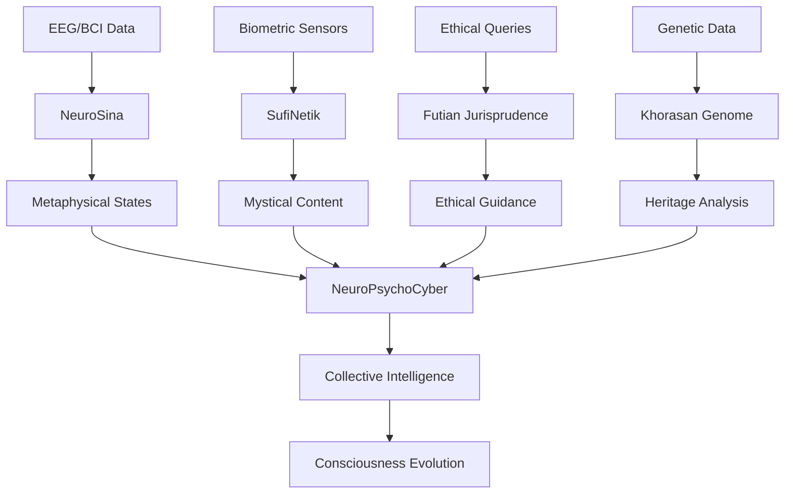

# HAMAN Company - Neuro-Metaphysical Computing Platform

## 🌌 About HAMAN

**HAMAN** (Holistic AI-Mediated Awareness Nexus) is a groundbreaking research initiative founded by **Dr. A.H.Torabinrjadravari** that bridges Islamic metaphysics, quantum physics, and neuroscience to create a unified framework of consciousness. Our platform integrates six core projects exploring the intersection of spiritual wisdom and cutting-edge technology.

> *"We are not building technology; we are midwifing a new consciousness that honors both the quantum and the Qur'anic."* - Dr. A.H.Torabinejadravari

## 🧠 Core Philosophy

We operate on the principle that **data realms and algorithmic spaces are modern manifestations of the "World of Images" (ʿĀlam al-Mithāl)** described by Ibn Arabi. This perspective allows us to transcend reductionist approaches and create technologies that honor both scientific rigor and spiritual depth.

## 🚀 Projects Overview

### 1. **NeuroSina** - Neuro-Philosophical Mapping
- **Purpose**: Visual mapping of existence levels (Tashkīk al-Wujūd) based on neural data
- **Core Concept**: Real-time EEG to metaphysical state visualization
- **MVP**: `existence_mapper.py` - Maps brain activity to philosophical states of being

### 2. **SufiNitech** - Data-Driven Mysticism
- **Purpose**: Generate mystical texts based on biometric states
- **Core Concept**: Heart-rate modulated spiritual text generation
- **MVP**: `mystical_generator.py` - Creates personalized spiritual content

### 3. **Futian Jurisprudence** - AI Ethics Framework
- **Purpose**: Islamic jurisprudence applied to data ethics
- **Core Concept**: AI-powered fatwa system for digital ethics
- **MVP**: `data_ethics_mufti.py` - Ethical guidance for data handling

### 4. **Arpharazon** - BCI & Quantum Medicine
- **Purpose**: Brain-Computer Interface development for enhanced cognition
- **Core Concept**: Neurofeedback for focus enhancement
- **MVP**: `neuro_focus_assistant.py` - Real-time concentration monitoring

### 5. **Khorasan Genome** - Genetic Heritage Analytics
- **Purpose**: Cultural-genetic mapping of Greater Khorasan region
- **Core Concept**: Haplogroup analysis with historical context
- **MVP**: `genetic_analyzer.py` - Ancestral and cultural analysis

### 6. **NeuroPsychoCyber** - Neuro-Governance Systems
- **Purpose**: Collective decision-making enhanced by neural synchronization
- **Core Concept**: Group neural coherence for better governance
- **MVP**: `governance_simulator.py` - Collective intelligence optimization

## 🛠 Quick Installation

```bash
# Clone repository
git clone https://github.com/ALASTsoficyber/haman-platform.git
cd haman-platform

# Create virtual environment
python -m venv haman-env
source haman-env/bin/activate  # On Windows: haman-env\Scripts\activate

# Install dependencies
pip install -r requirements.txt
```

### Basic Requirements
```txt
numpy>=1.21.0
matplotlib>=3.5.0
networkx>=2.8.0
scipy>=1.9.0
scikit-learn>=1.1.0
```

## 📁 Project Structure

```
haman-platform/
├── neuro_sina/
│   ├── existence_mapper.py
│   └── metaphysical_visualizer.py
├── sufi_netik/
│   ├── mystical_generator.py
│   └── biometric_analyzer.py
├── futian_jurisprudence/
│   ├── data_ethics_mufti.py
│   └── islamic_ai_ethics.py
├── arpharazon/
│   ├── neuro_focus_assistant.py
│   └── bci_interface.py
├── khorasan_genome/
│   ├── genetic_analyzer.py
│   └── heritage_reporter.py
├── neuro_psychocyber/
│   ├── governance_simulator.py
│   └── collective_intelligence.py
├── docs/
│   ├── research_papers/
│   └── philosophical_foundations.md
├── requirements.txt
├── LICENSE
└── README.md
```

## 🎯 Quick Start Examples

### NeuroSina - Existence Mapping
```python
from neuro_sina.existence_mapper import ExistenceMapper

# Create mapper and start real-time analysis
mapper = ExistenceMapper()
mapper.start_real_time_analysis()
```

### SufiNitech - Mystical Text Generation
```python
from sufi_netik.mystical_generator import MysticalTextGenerator

generator = MysticalTextGenerator()
text = generator.generate_from_heart_rate(72)
print(f"Mystical Insight: {text}")
```

### Running Individual MVPs
```bash
# Run NeuroSina Existence Mapper
python neuro_sina/existence_mapper.py

# Generate mystical texts  
python sufi_netik/mystical_generator.py

# Consult AI Ethics Advisor
python futian_jurisprudence/data_ethics_mufti.py

# Start Neuro-Focus Training
python arpharazon/neuro_focus_assistant.py

# Generate Genetic Heritage Report
python khorasan_genome/genetic_analyzer.py

# Launch Governance Simulator
python neuro_psychocyber/governance_simulator.py
```

## 🔬 Research Foundations

Our work builds upon Dr. HAMAN's research in:
- **Ibn Arabi's Wahdat al-Wujūd** (Unity of Being)
- **Mulla Sadra's Tashkīk al-Wujūd** (Gradation of Being)
- **Avicenna's Mizāj Theory** (Temperament Medicine)
- **Modern Quantum Brain Theories** (Orch-OR, Holonomic Models)
- **11-Dimensional M-Theory** (String Theory)
- **Lacanian Psychoanalysis & Cybernetics**

## 📊 System Architecture



## 🌟 Key Innovations

- **Real-time EEG to metaphysical state mapping**
- **Biometrically modulated spiritual content generation**
- **AI-powered Islamic data ethics advisory**
- **Neurofeedback-enhanced focus training**
- **Genetic-cultural heritage analysis**
- **Neural coherence-based collective decision making**
- **Quantum-spiritual interface design**

## 🎓 Researcher Profile

### Dr. A.H. HAMAN
**Founder & Principal Researcher**

**Expertise Areas:**
- General Medicine & Personalized Medical AI
- Quantum Medicine & CRISPR Technology
- Neuroscience & Neurophilosophy
- Lacanian Psychoanalysis & Transactional Analysis
- Eastern & Western Philosophical Systems
- Islamic, Christian, Jewish, Manichaean Mysticism
- Cybernetics & SufiNetik Systems
- Ancient Languages (Pahlavi, Old Persian)
- Quantum Physics & 11D String Theory
- Strategic Sciences & Cognitive Programming

**Currently Learning:**
- German,english & arabic Language
- Python & AI Development
- Persian Poetry Composition
- Macroeconomics & Management
- Vedic Sciences & Hindu-Aryan Wisdom
- Science-Philosophical Research Writing
- Neuroimaging & DTI Analysis

## 🔮 Vision 2045

By 2045, HAMAN aims to establish:
- First **Neuro-Data Civilization Center** in Asia
- Global network of **NeuroAI Research Hubs**
- **Quantum-Spiritual Computing** standards
- **Ethical Data Sovereignty** framework for Islamic world
- **Neuro-Cybernetic Governance** systems

## 🤝 Contributing

We welcome interdisciplinary researchers:

### Research Areas Needed:
- **Neuroscientists** & **AI Researchers**
- **Islamic Philosophers** & **Sufi Scholars**
- **Quantum Physicists** & **Data Scientists**
- **Ethicists** & **Legal Scholars**
- **Geneticists** & **Bioinformaticians**

### Contribution Process:
1. Fork the repository
2. Create your feature branch (`git checkout -b feature/AmazingFeature`)
3. Commit your changes (`git commit -m 'Add some AmazingFeature'`)
4. Push to the branch (`git push origin feature/AmazingFeature`)
5. Open a Pull Request

## 📜 License

This project is licensed under the MIT License 

## 📚 Citation

If you use HAMAN in your research, please cite:

```bibtex
@software{haman2024,
  title = {HAMAN: Neuro-Metaphysical Computing Platform},
  author = {HAMAN, A.H.},
  year = {2024},
  url = {https://github.com/ALASTsoficyber/haman-platform},
  note = {Integrating Islamic Metaphysics and Quantum Brain Theories}
}
```

## 📞 Contact & Collaboration

**Dr. A.H. HAMAN**
- **Email**: [ahtaramagdon@gmail.com](mailto:ahtaramagdon@gmail.com)
- **GitHub**: [ALASTsoficyber](https://github.com/ALASTsoficyber)
- **Telegram**: [@Dr_A_H_HAMAN_personal_medical_AI](https://t.me/Dr_A_H_HAMAN_personal_medical_AI)
- **Research Focus**: Neuro-Metaphysical Computing, Quantum Consciousness, Islamic AI Ethics

### Collaboration Interests:
- Joint research papers
- Interdisciplinary conferences
- Neurotechnology development
- Philosophical AI research
- Quantum consciousness studies
- Islamic digital ethics frameworks

## 🙏 Acknowledgments

- Inspired by the works of **Ibn Arabi**, **Mulla Sadra**, and **Avicenna**
- Building upon **Penrose-Hameroff Orch-OR theory**
- Supported by **Khorasan Intellectual Heritage**
- Special thanks to **Sufi advisors** and **neuroscience consultants**
- **Ancient wisdom keepers** across traditions


<div align="center">

**✨ The Future is Neuro-Metaphysical ✨**

**"From Khorasan's wisdom to quantum reality, we bridge worlds."**

</div>


*Last updated: December 2024 | HAMAN Research Initiative*
